\newpage
# Memasang BlankOn

Bab ini membahas bagaimana cara memasang BlankOn pada komputer. Pemasangan BlankOn akan sangat mudah dilakukan apabila Anda sudah memahami persiapan dan langkah-langkah apa saja yang perlu dilakukan.

## Kebutuhan Sistem
Sebelum melakukan pemasangan, maka perlu diperhatikan terlebih dahulu apakah komputer Anda sudah memenuhi syarat spesifikasi minimal agar BlankOn bisa berjalan dengan lancar. Berikut ini adalah spesifikasi minimal untuk BlankOn XI Uluwatu:
  * Prosesor setara pentium IV dengan kecepatan minimal 2,8 Ghz (rekomendasi Dual Core)
  * Memori RAM 1 GB
  * Kartu video atau VGA minimal memiliki memori 128 MB atau 512 MB untuk efek desktop.
  * Media Simpan dengan ukuran 12 GB atau lebih.
  * Menggunakan arsitektur amd 64 bit.

## Cara Mendapatkan BlankOn
Untuk mendapatkan berkas iso BlankOn, Anda bisa mengunduhnya dari situs resmi BlankOn [http://cdimage.blankonlinux.or.id/](http://cdimage.blankonlinux.or.id/). Berkas cetakan tersebut selanjutnya dapat dibuat *bootable* ke Flashdisk atau Harddisk External dengan Unetbootin, cara lainya adalah dengan dibakar ke DVD kosong menggunakan aplikasi pembakar DVD seperti Brasero, K3b, Nero, Roxio, dsb.

### Tip:
Agar proses pengunduhan berkas iso BlankOn lebih lancar, Anda dapat memanfaatkan situs cermin (*mirror*) berikut ini:

  * http://kambing.ui.ac.id/iso/blankon
  * http://mirror.unej.ac.id/blankon-cd
  * ftp://dl2.foss-id.web.id/iso/blankon
  * http://buaya.klas.or.id/pub/blankon
  * http://pandawa.ipb.ac.id/iso/blankon/
  * http://repo.ugm.ac.id/iso/blankon
  * http://jaran.undip.ac.id/public/ISO/
  * http://mugos.ums.ac.id/iso/Blankon
  * http://pinguin.ittelkom.ac.id/mirror/iso/blankon/
  * ftp://ftp.paudni.kemdiknas.go.id/blankon/
  * ftp://singo.ub.ac.id/linux/blankon/

Bagi Anda yang memiliki koneksi terbatas atau tidak dapat terhubung dengan internet, dapat membeli DVD BlankOn melalui toko penjual DVD atau meminjamnya dari teman yang telah memilikinya. Berikut adalah beberapa toko penjual CD/DVD Linux yang ada di Indonesia: 
	
  * Juragan Kambing ( http://juragan.kambing.ui.ac.id/)
  * Toko Baliwae ( http://toko.baliwae.com/)
  * Gudang Linux ( http://gudanglinux.com/)
  * Lapak Linux dan FOSS ( http://www.lapak-linux-dan-foss.com/)

## Persiapan Menjelang Pemasangan
Sebelum melakukan pemasangan BlankOn, lakukan beberapa persiapan seperti berikut:

  1. Persiapkan flashdisk atau DVD BlankOn sebagai alat yang akan gunakan untuk mencoba dan atau memasang BlankOn pada komputer. Pastikan flashdisk atau DVD dalam keadaan baik agar proses pemasangan lancar.

  2. Agar data Anda aman dan terhindar dari resiko kehilangan data, buatlah cadangan data-data penting ke media simpan cadangan seperti misalnya flashdisk, harddisk, atau CD/DVD.

  3. Tentukan skema partisi harddisk yang Anda inginkan. Partisi merupakan bagian ruang-ruang data yang terdapat pada media simpan. Jika Anda ingin membuat *dual-boot* (terdapat dua sistem operasi dalam satu komputer), Anda harus membuat partisi baru pada media simpan di komputer yang nantinya akan digunakan sebagai tempat pemasangan BlankOn. Pembahasan lebih lanjut akan dijelaskan pada sub-bab pemasangan.

  4. Pastikan tegangan listrik stabil. Hal ini perlu dilakukan untuk menghindari listrik yang tiba-tiba padam pada saat pemasangan dan menyebabkan terjadinya kerusakan fisik pada komputer, terutama media simpan.

  5. Lakukan pengaturan pada BIOS agar komputer membaca flashdisk atau DVD terlebih dahulu untuk proses booting. Silahkan merujuk ke buku manual komputer atau motherboard anda mengenai cara melakukan pengaturan ini.

## Mengatur Bahasa dan Memilih Moda
Jendela yang tampil pertama ketika Anda menjalankan BlankOn XI Uluwatu melalui DVD atau Flashdisk adalah **Pilih Bahasa** dan **Pilih Moda**.

### Mengatur Bahasa
Secara baku BlankOn XI Uluwatu menyediakan dua bahasa ketika akan melakukan pemasang, yaitu **Bahasa Inggris** dan **Bahasa Indonesia**. Pilih bahasa yang sesuai, dalam buku Panduan ini menggunakan **Antarmuka Bahasa Indonesia**.

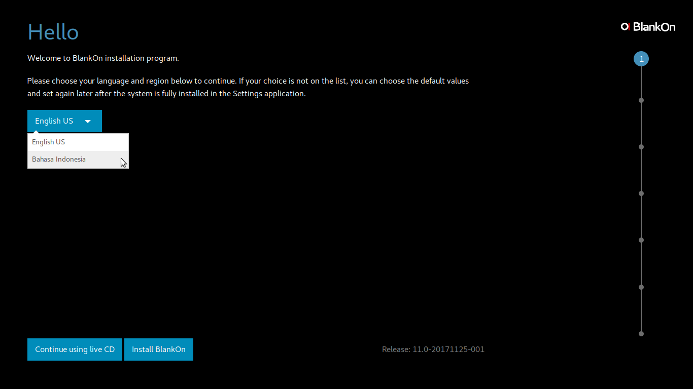

### Memilih Moda
Anda dapat memilih, apakah  Anda akan langsung menjalankan BlankOn XI Uluwatu melalui Live DVD/USB tanpa memasangnya ke komputer atau langsung memasangnya pada media simpan.

## Memasang BlankOn
Klik tombol **Pasang BlankOn**

### Pilih Zona waktu
Beberapa saat setelah Anda menekan tombol **Pasang BlankOn**, maka tampil jendela untuk memilih **Zona Waktu** sesuai tempat Anda berada. Contoh, pilih **Asia/Jakarta**, klik tombol **Lanjut** untuk menuju proses berikutnya.

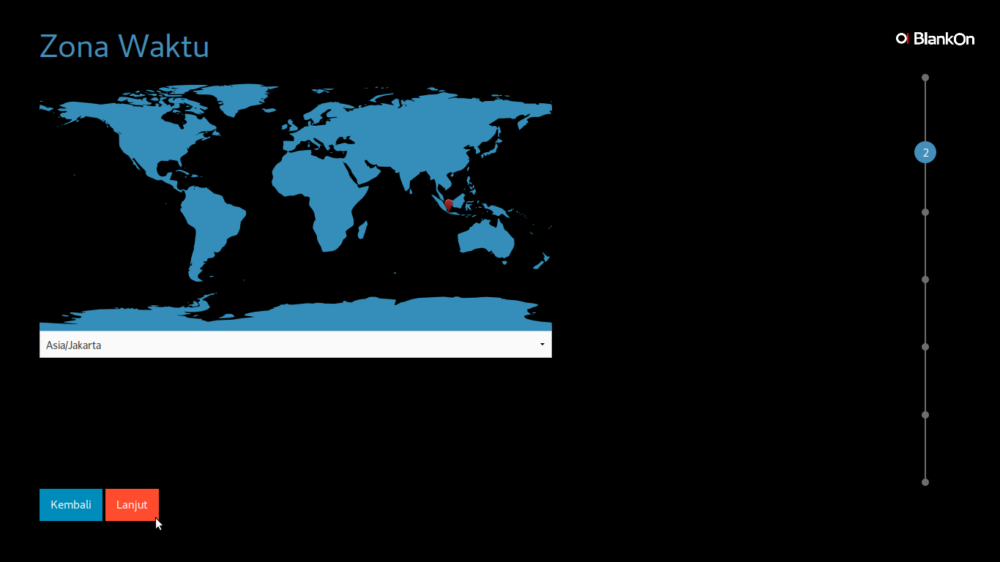

### Pilih Media
Klik **Pilih diska...** dan pilih media simpan di komputer Anda sebagai tempat pemasangan BlankOn XI Uluwatu. Jika di komputer Anda terpasang lebih dari satu media simpan, harap berhati-hati dalam memilih media simpan yang akan digunakan. Klik tombol **Lanjut**.

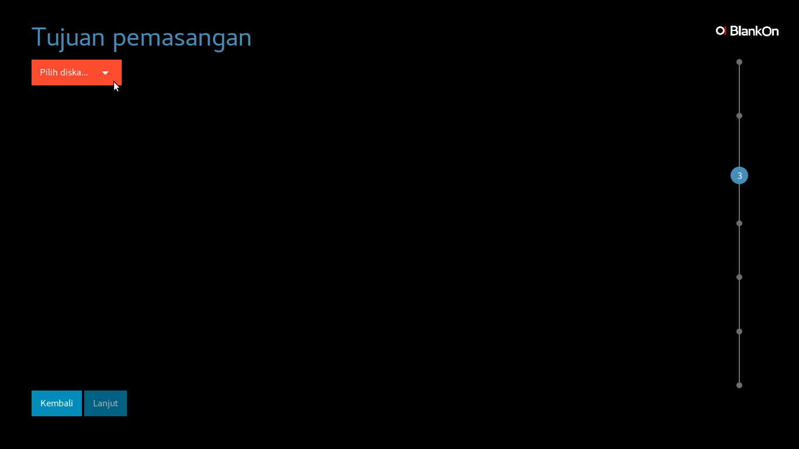

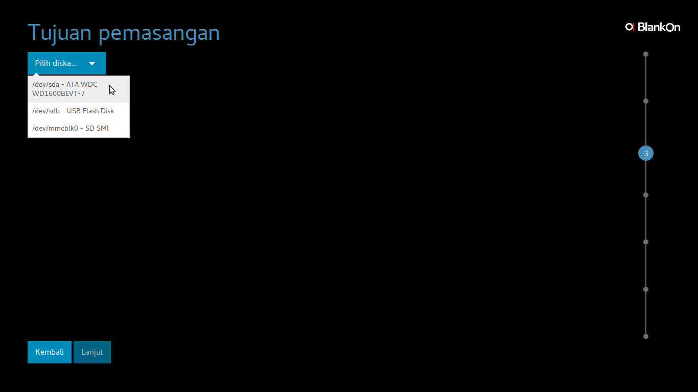

### Memilih Moda Pemasangan
BlankOn menyediakan dua moda pemasangan;
1. Pemasangan Bersih
2. Moda Mahir

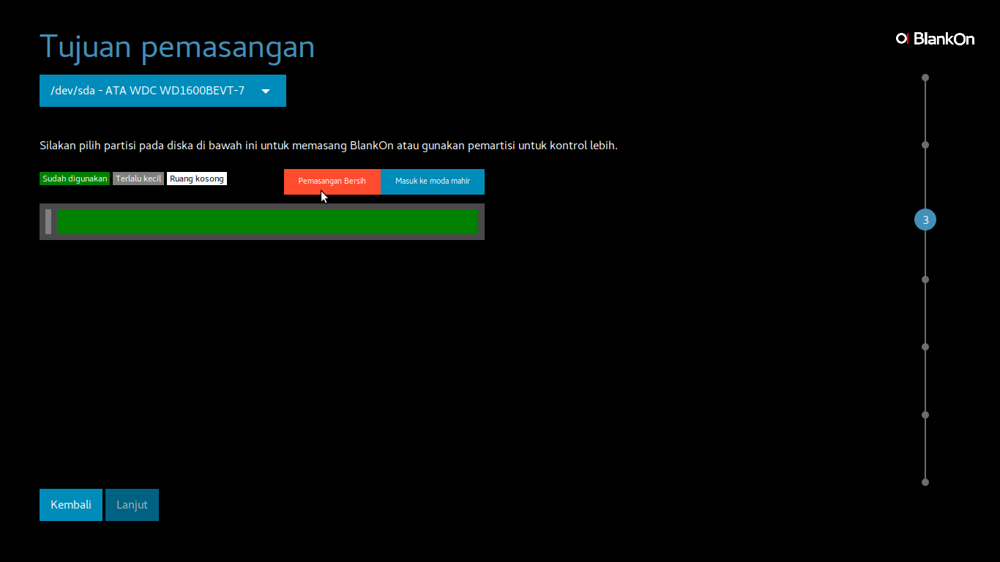

### Pemasangan Bersih
Bila kita memilih **Pemasangan Bersih**, pada kotak dialog berikutnya akan muncul peringatan;
>**Peringatan:** Tindakan ini akan menghapus program, dokumen, foto, musik dan berkas lain di semua sistem operasi yang ada.

Bila Anda setuju, klik **lanjut**. Bila Anda tidak setuju, klik **Batal**.

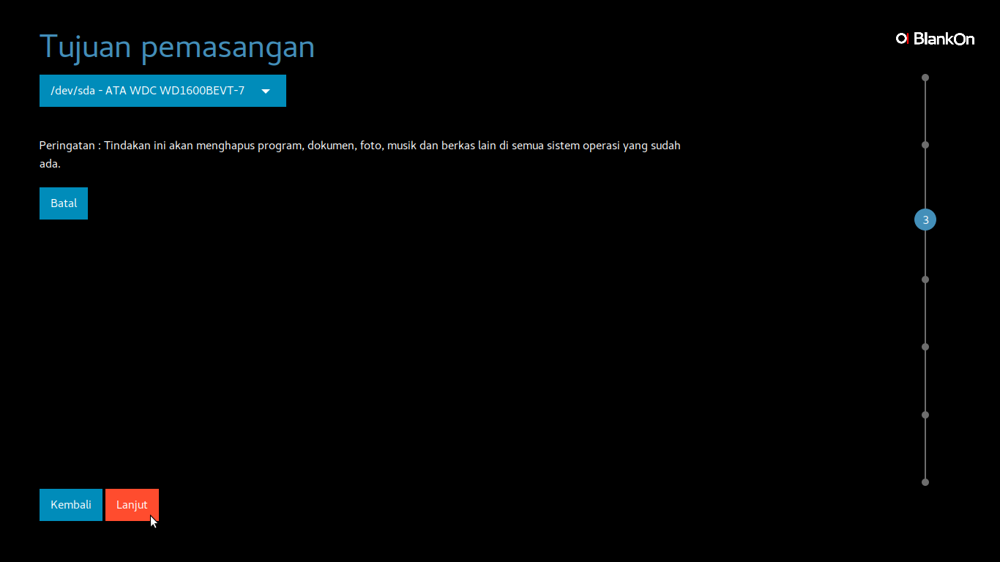

### Memilih Partisi
Bila media simpan/*harddisk* yang akan digunakan masih kosong dan belum memiliki partisi, maka Anda perlu membuat partisi secara manual dengan cara memilih **Masuk ke moda mahir**.

#### Buat Partisi
Klik tombol **Buat** untuk mulai membuat partisi.
    
#### Pilih Jenis Partis
Buat partisi baru pada media simpan, tentukan ukurannya dengan cara klik bagian partisi atau mengeser tanda kotak kecil bagian atas. Partisi yang akan dibuat berwarna biru, sedangkan yang masih kosong berwarna abu-abu. Tentukan juga jenis partisi yang akan digunakan, dalam contoh pilih **Primary**, klik tombol **Apply** untuk melanjutkan ke langkah berikutnya.

##### Catatan Mengenai Partisi
  * Partisi *Primary*/Primer: Jenis partisi ini merupakan partisi utama di media simpan (*harddisk*) untuk sistem operasi pada umumnya. Partisi primer hanya bisa dibuat maksimal 4 partisi. Hal ini berbeda dengan sistem DOS yang hanya mengijinkan satu jenis partisi primer untuk sistem. Jika kita memakai sistem operasi Linux, jenis partisi ini akan terbaca sebagai partisi 1, 2, 3 dan 4. Misalnya terbaca sebagai sda1, sda2, sda3 dan sda4, sedangkan jika kita menggunakan Sistem Operasi Windows akan terbaca sebagai partisi C,D,E dan F.

  * Partisi *Extended*/Perluasan: Partisi Extended/Perluasan: Merupakan partisi perluasan untuk mengatasi kekurangan partisi primer dimana hanya dimungkinkan adanya 4 partisi. Jika ingin memiliki partisi lebih dari 4 maka partisi extended/perluasan dibutuhkan yaitu dengan cara mengubah satu partisi primer menjadi partisi extended/perluasan. Di dalam partisi extended ini dapat dibuat partisi logical untuk mendapatkan partisi yang lebih banyak. Partisi extended tidak dapat digunakan menyimpan data. Partisi jenis ini selalu menempati nomor partisi 4 (empat) dari partisi primer. Jika ada 2 partisi primer pada *harddisk* sda maka posisi partisi extended adalah sda4.

  * Partisi Logical: Jenis partisi logical selalu dibuat di dalam partisi extended/perluasan. Partisi ini akan terbaca mulai angka 5 (lima). Misalnya kita membuat 5 jenis partisi logical di dalam partisi extended maka masing-masing akan terbaca sebagai sda5, sda6, sda7, dan seterusnya.

#### Memilih Mount Point
Pilih **Mount Point** atau titik kait untuk partisi yang akan dibuat. Contoh, kita pilih **/Home**. Klik tombol **Apply** untuk menerapkan pembuatan partisi yang telah dilakukan.

#### Membuat Partisi Extended
Klik tombol **Buat** untuk membuat partisi baru pada media simpan yang masih kosong, pada sub menu jenis partisi pilih **Extended**.  Tujuan dari langkah ini adalah agar kita dapat membuat partisi lebih dari empat dalam media simpan. Jika semua langkah dirasa sudah benar, klik tombol **Apply** untuk menerapkan pembuatan partisi.

#### Membuat Partisi Root
Klik tombol **Buat** untuk membuat partisi baru dalam partisi *extended* (partisi jenis ini disebut partisi *logical*). Tentukan ukuran partisi yang akan dibuat, misalnya 28,88 GB. Bila kita ingin membuat partisi untuk sistem operasi maka pada sub menu **Mount Point** pilih /**(root)**. Klik tombol **Apply** untuk menerapkan pembuatan partisi.

#### Membua Partisi Swap
Klik tombol **Buat** untuk membuat partisi baru sebagai partisi Swap. Gunakan ukuran dua kali lipat dari ukuran RAM fisik yang terpasang di komputer. Pada sub menu **Mount Point** pilih **use as Swap**. Klik tombol **Apply** untuk menerapkan pembuatan partisi.

**Catatan**
  * Jika ukuran **RAM fisik** yang terpasang sudah besar tidak perlu menggunakan acuan dua kali lipat.

#### Membuat Partisi Bebas
Klik tombol **Buat** untuk membuat partisi baru pada ruang kosong di media simpan sisa dari partisi yang telah dibuat sebelumnya. Karena partisi ini tidak akan dikaitkan sebagai sistem tertentu pada komputer (digunakan sebagai partisi bebas), maka pada sub menu **Mount point** pilih **Without mount point**. Klik tombol **Apply** untuk menerapkan pembuatan partisi. Pembuatan partisi sudah selesai. Untuk melanjutkan proses pemasangan BlankOn XI uluwatu, klik tombol **Apply**.

#### Personalisasi
Masukkan informasi tentang nama komputer, nama pengguna serta *password*/kata sandi pengguna. Ketik beberapa informasi tersebut pada kotak yang tersedia. Jika ketika Anda ingin masuk ke destop tanpa harus memasukkan kata sandi,klik dan beri tanda pada kotak di samping kiri **Masuk secara otomatis**. Klik tombol **Lanjut** untuk melanjutkan ke langkah berikutnya.

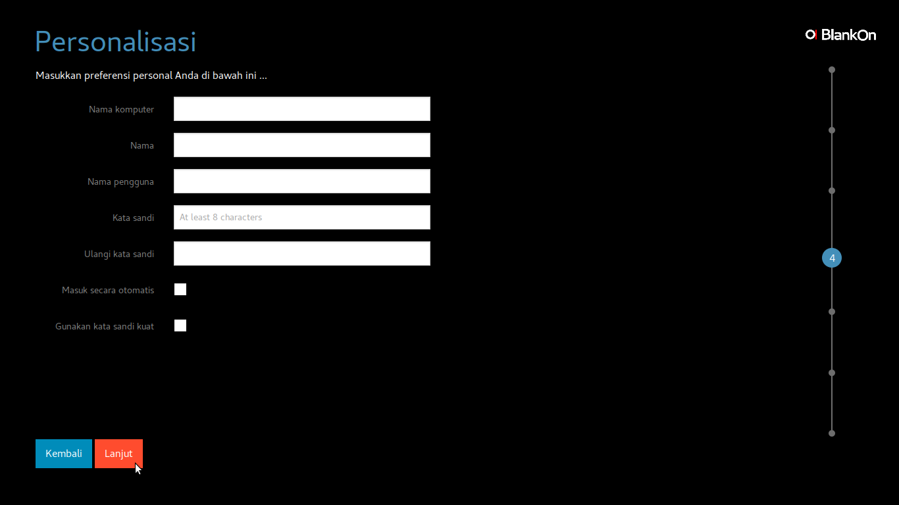

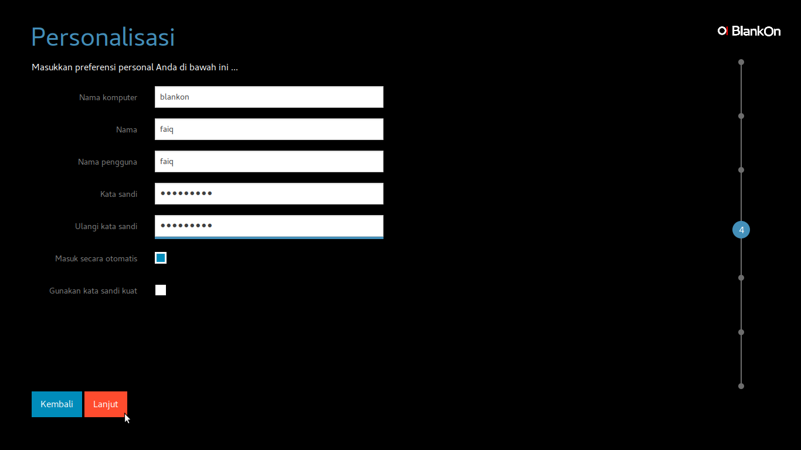

#### Ringkasan Pemasangan
Periksa ringkasan informasi yang telah dibuat sebelumnya. **Ringkasan Pemasangan** berisi keterangan dari Media simpan dan partisi target pemasangan, Nama komputer, Nama pengguna, dan keterangan mode masuk ke destop. Klik tombol **Pasang BlankOn** untuk melakukan pemasangan BlankOn sesungguhnya.

**Catatan:**
  * Jika Anda masih ragu untuk melanjutkan ke proses berikutnya tekan tombol **Kembali** untuk menyunting/*mengedit informasi pada komputer yang akan dipasang BlankOn.

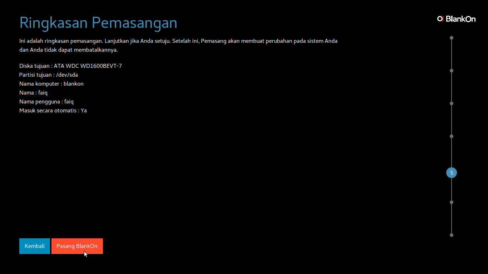

#### Proses Pemasangan
Ketika muncul tampilan proses Pemasangan BlankOn yang sedang berlangsung, tunggu beberapa saat hingga selesai.

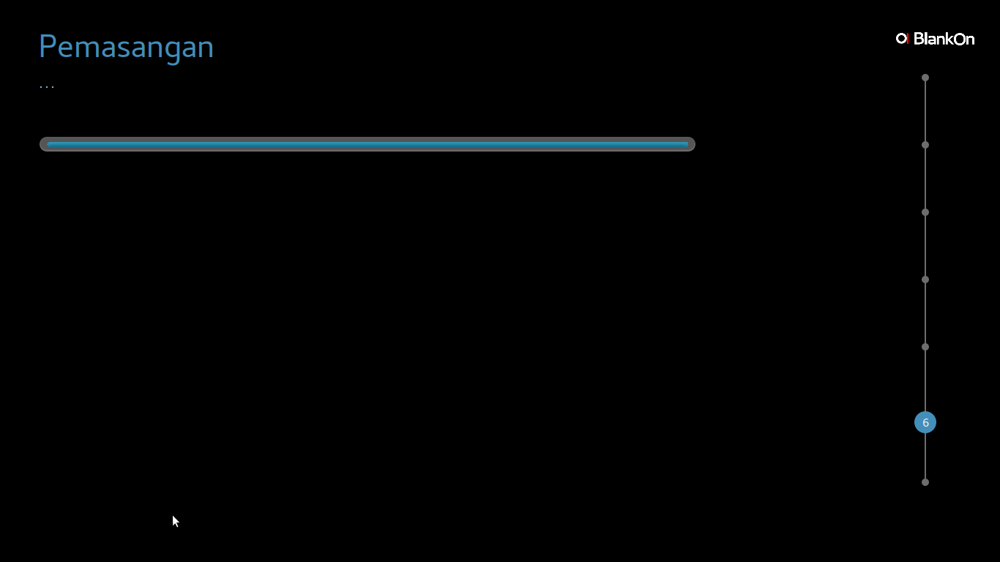

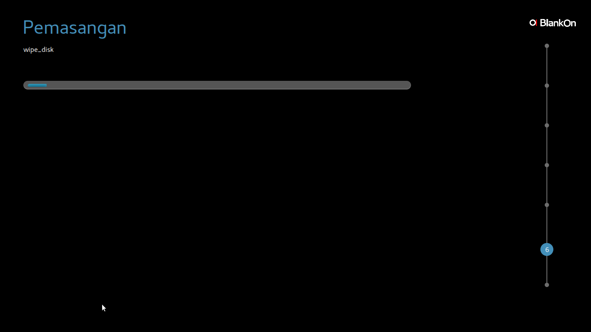

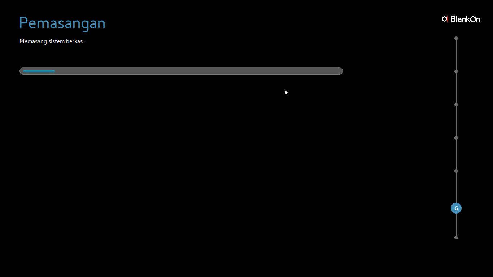

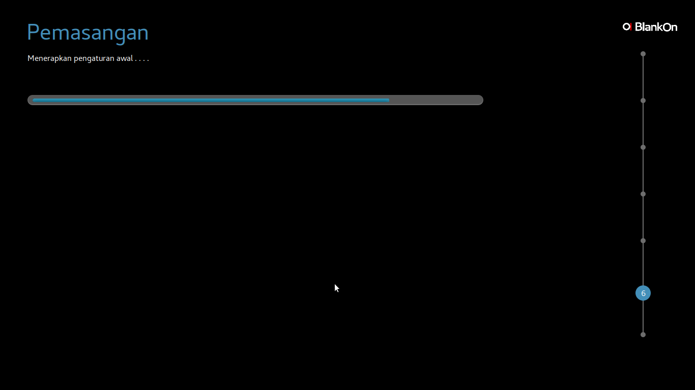

Bila pada saat proses pemasangan muncul kotak pesan **blankon-installer is not responding**, Anda tetap dapat melanjutkan pemasangan dengan memilih **Wait**.

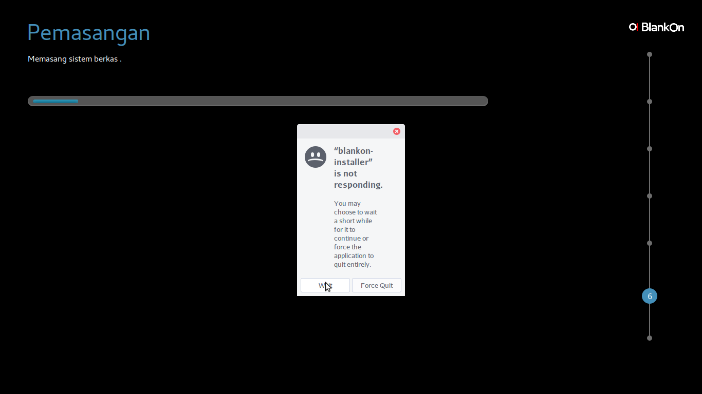

#### Pemasangan Selesai
Setelah proses pemasangan berhasil maka akan muncul jendela berisi dua pilihan yaitu **Lanjut menggunakan sistem dalam moda live** atau **Mula Ulang**, klik salah satu dari kedua pilihan tersebut sesuai selera Anda.

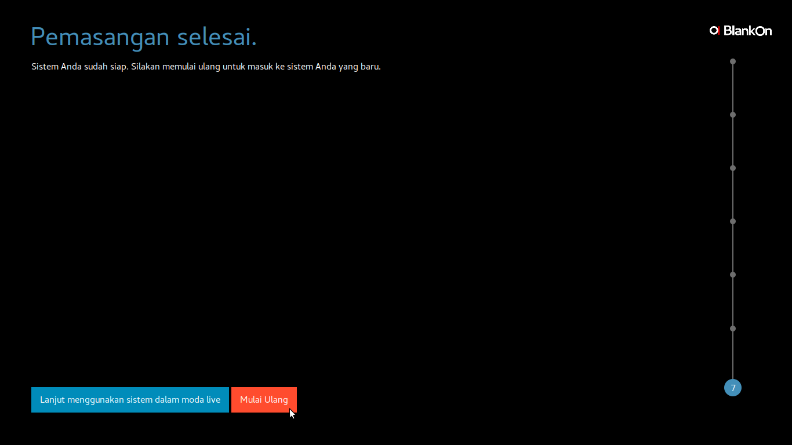

## Pasang BlankOn Berdampingan dengan Sistem Operasi Lain
Pada sub bab sebelumnya sudah dijelaskan cara memasang BlankOn XI Uluwatu pada media simpan yang masih kosong atau pada komputer yang belum memiliki sistem operasi. Pada sub bab ini akan dijelaskan bagaimana cara memasang BlankOn XI Uluwatu pada komputer yang sudah memiliki sistem operasi tanpa menghapus sistem operasi tersebut, atau dengan kata lain memasang BlankOn berdampingan dengan sistem operasi lain (*dual boot*)

Bila pada media simpan masih ada partisi yang kosong, kita dapat langsung BlankOn pada partisi tersebut. Akan tetapi jika media simpan sudah tidak memiliki partisi yang masih kosong maka Anda perlu menyiapkan partisi kosong dengan cara memotong salah satu partisi yang sudah ada. Di bawah ini adalah penjelasan singkat cara menyiapkan partisi baru pada komputer yang belum memiliki partisi kosong

### Menyiapkan Partisi
Nyalakan komputer dan jalan BlankOn XI Uluwatu melalui **live DVD** atau **Flashdisk**, kemudian pilih opsi **Lanjut menggunakan sistem dalam moda live**.

##### Catatan:
  * Jika media simpan di komputer yang akan dipasang BlankOn XI Uluwatu sudah tersedia partisi kosong langsung pilih **Pasang BlankOn**.

##### Peringatan
  * Sebelum mengikuti panduan pada sub bab ini lebih lanjut, sebaiknya pahami dulu lebih dalam mengenai manajemen partisi pada komputer. Anda juga perlu membuat data cadangan (*backup*) data penting yang ada di dalam partisi yang akan disunting ke media simpan luar (misal: hard disk external), karena resiko kehilangan data sangat besar.

#### Menjalankan GParted
Untuk mengatur partisi di media simpan pada BlankOn XI Uluwatu dapat dilakukan dengan menggunakan aplikasi penyunting partisi bernama **Gparted**, berikut cara menggunakannya:
Buka aplikasi penyunting partisi melalui **Menu utama BlankOn** => **Administrasi** => **Gparted Partition Editor**

#### Memilih Media Simpan
Langkah pertama untuk menyunting partisi adalah **memilih media simpan** yang terpasang di komputer. Hal ini wajib dilakukan jika pada komputer yang akan Anda pasang sistem operasi baru memiliki lebih dari satu media simpan, untuk melakukannya klik tanda segitiga kecil menghadap ke bawah di sebelah kanan Baris Alat /*Tool bar*, pilih salah satu media simpan yang akan digunakan sebagai tempat pemasangan sistem operasi.

#### Mengubah Ukuran Partisi
Dalam contoh buku ini media simpan yang digunakan sudah tidak memiliki partisi kosong lagi sebagai tempat pemasangan sistem operasi baru. Satu-satunya cara agar dapat memasang sistem operasi baru adalah mengubah ukuran partisi yang sudah ada dengan cara memperkecil ukurannya, kemudian menambahkan partisi baru.

Berikut caranya; Letakkan kursor pada partisi paling akhir, **klik kanan** => **Ubah Ukuran/Pindahkan**

Seret tanda segitiga kecil sebelah kanan partisi tersebut ke arah kiri hingga kotak di sebelah kanan berubah menjadi abu-abu. Tentukan ukuran partisi baru yang akan Anda buat, kemudian klik tombol **Ubah Ukuran/Pindahkan**.

Jika penyuntingan partisi dirasa sudah benar, klik ikon **Terapkan Semua Operasi**.

Jika muncul peringatan untuk melakukan perubahan klik **Terapkan Semua Operasi** untuk melanjutkan proses penggeseran partisi, jika masih ragu-ragu klik tombol **Batal**.

Maka proses penggeseran partisi segera berlangsung. Tunggu hingga selesai, kemudian klik tombol **Tutup**. Lama proses penggeseran partisi tergantung dari banyaknya data dan spesifikasi komputer yang Anda gunakan.

Sekarang Anda sudah memiliki area yang masih kosong pada media simpan yang terpasang di komputer Anda. Area kosong tersebut dapat digunakan sebagai tempat pemasangan sistem operasi baru. Anda dapat langsung membuat partisi baru atau langsung memasang sistem operasi baru pada area kosong tersebut. Dalam  buku ini menggunakan pilih kedua, yaitu memasang langsung sistem operasi baru pada area kosong tersebut, caranya kurang lebih sama dengan memasang BlankOn yang sudah dijelaskan pada sub bab sebelumnya.

