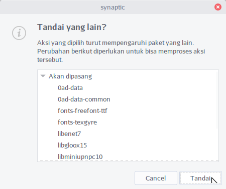

\newpage
# Manajemen Paket BlankOn XI Uluwatu

Bab ini menjelaskan tentang cara memasang, menghapus dan merawat perangkat lunak pada BlankOn XI Uluwatu. BlankOn Linux sudah menyertakan berbagai perangkat lunak untuk keperluan dasar seperti aplikasi perkantoran, multimedia, internet, grafis, dan lain-lain. Anda juga dapat melakukan pemasangan perangkat lunak baru yang Anda inginkan sesuai dengan keperluan.

**Peringatan**!

  * Pemasangan dan penghapusan perangkat lunak membutuhkan hak administratif karena dapat mengubah sistem. Oleh karena itu, yang dapat melakukan hal tersebut hanyalah pengguna yang memiliki kewenangan administratif.

## Pengaturan Perangkat Lunak pada BlankOn Linux
Seperti pada distro Linux lainnya, pemasangan perangkat lunak pada BlankOn menggunakan sistem manajemen paket perangkat lunak. Manajemen paket yang digunakan BlankOn Linux adalah APT. Hampir semua perangkat lunak Linux berasal dari lumbung paket (*package repository*). APT adalah program yang berfungsi untuk mengunduh (*download*) paket yang Anda pilih dari lumbung dan memasangnya di komputer.

Dengan APT, Anda hanya perlu menentukan sumber paket atau lumbung paket perangkat lunak melalui APT, dan meminta perangkat lunak yang ingin dipasang atau dihapus. APT akan melakukan apa yang Anda inginkan termasuk mengunduh paket, memasang, melakukan konfigurasi sistem, pemutakhiran (*update*) serta penghapusan.

Lumbung paket dapat berada dari empat sumber, yaitu:
  * Server Web
  * Jaringan Lokal, misalnya dari server NFS, 
  * CD/DVD-ROM,
  * Folder lokal.

Komunitas BlankOn memiliki lumbung paket resmi yang berada di situs [http://arsip.blankonlinux.or.id/blankon](http://arsip.blankonlinux.or.id/blankon). Lumbung paket BlankOn berisi berbagai koleksi perangkat lunak yang siap untuk digunakan.

Selain lumbung paket resmi, juga terdapat lumbung paket-lumbung paket lainnya yang isinya sama, namun berbeda letak servernya. Sebagian besar dari lumbung paket yang ada disediakan oleh penyedia jasa cermin (*mirror*) dan beberapa perguruan tinggi di Indonesia. Berikut adalah beberapa alamat lumbung paket yang ada di Indonesia:

  * [http://kambing.ui.ac.id/blankon/](http://kambing.ui.ac.id/blankon/) (Universitas Indonesia)
  * [http://repo.ugm.ac.id/blankon/](http://repo.ugm.ac.id/blankon/) (Universitas Gajah Mada)

## Pengaturan Lumbung Paket
Untuk melakukan pengaturan lumbung paket APT, klik Menu utama **BlankOn** => **Administrasi** => **Synaptic Manajer Paket**. Kemudian ketik kata sandi Anda.


Setelah Synaptic terbuka, pilih **Pengaturan** => **Repositori**. Berikut adalah cara-cara pengaturan lumbung paket dari setiap jenis sumber.


### Lumbung Paket Resmi BlankOn (Internet)
Jika Anda ingin melakukan pengaturan sumber perangkat lunak dari *mirror* resmi BlankOn linux, Anda bisa melihat pada tab **Perangkat Lunak BlankOn**. Pilih semua cabang perangkat lunak yang tersedia pada bagian **Paket dari Internet**. Kemudian tentukan cermin yang akan Anda gunakan pada bagian **Unduh dari**.

### Lumbung Paket Jaringan Lokal (Intranet)
Beberapa institusi pendidikan dan kantor menyediakan lumbung paket secara lokal yang bisa Anda manfaatkan untuk menekan biaya penggunaan *bandwidth* internet. Untuk memanfaatkannya, silahkan tanya kepada administrator jaringan Anda tentang baris APT dari lumbung paket termasuk lumbung paket untuk pemutakhiran (jika ada). Lalu tambahkan baris APT baru sesuai dengan cara yang dijelaskan di atas.

Setelah semua pengaturan lumbung paket selesai dilakukan, klik tombol **Tutup**. Kemudian APT akan meminta Anda untuk mengunduh informasi paket dari setiap lumbung paket, klik pada tombol **Muat Ulang**. Sekarang, Anda siap melakukan penambahan perangkat lunak untuk BlankOn Linux.

## Memasang dan Menghapus Perangkat Lunak
Terdapat dua cara untuk melakukan pemasangan dan penghapusan perangkat lunak. Yaitu melalui fitur manajer paket Synaptic dan melalui antarmuka teks dengan perintah apt.

### Manajer Paket Synaptic
Jika Anda ingin memasang atau menghapus perangkat lunak secara detail, Anda bisa menggunakan aplikasi Synaptic yang bisa Anda buka melalui **Menu utama BlankOn** =>  **Administrasi** => **Manajer paket Synaptic**

Ketik nama aplikasi pada kotak pencarian cepat. Aplikasi ini menampilkan daftar paket perangkat lunak secara detail. Selain itu,  Anda juga bisa menambah dan menghapus aplikasi atau pustaka sistem. Untuk menandai paket perangkat lunak yang ingin dipasang, **klik kanan** pada aplikasi yang hendak dipasang lalu pilih menu **Tandai untuk Pemasangan**.


Sedangkan jika ingin menghapus paket perangkat lunak, klik kanan pada aplikasi lalu pilih menu **Tandai untuk dibuang**. Kadangkala, suatu paket perangkat lunak akan meminta satu atau beberapa paket perangkat lunak untuk dipasang (ketergantungan).



Jika muncul jendela yang menanyakan hal tersebut, Anda harus setuju untuk menandai paket perangkat lunak yang dibutuhkan agar Anda bisa memasang paket perangkat lunak yang Anda inginkan.


Untuk menerapkannya, klik tombol **Terapkan** pada *toolbar*, kemudian klik tombol **Terapkan** pada jendela konfirmasi. Maka APT akan memasang/menghapus perangkat lunak yang Anda minta.


### Melalui Perintah apt
Menggunakan perintah apt sangat sederhana sekali. Anda cukup ketikkan nama paket perangkat lunak yang ingin dipasang/dihapus, maka APT akan melakukan hal yang Anda inginkan.

Untuk menggunakan fitur ini, bukalah Terminal dengan klik **Menu Utama BlankOn** => **Perkakas Sistem** => **Terminal**.


Pada terminal ketik perintah `sudo apt install namapaket`. Ubah “namapaket” sesuai dengan nama paket perangkat lunak yang hendak Anda pasang. Misalnya, untuk memasang aplikasi htop, Anda dapat mengetik perintah `sudo apt install hatop`;

```terminal
blankon@blankon:~$ sudo apt install htop
```
Tekan tombol **Enter** untuk memasang paket perangkat lunak. Isikan kata sandi sesuai dengan yang Anda buat ketika melakukan pemasangan BlankOn.

Sedangkan untuk menghapus suatu perangkat lunak, ketik perintah `sudo apt remove namapaket`. Contoh di bawah ini adalah perintah untuk menghapus aplikasi htop;

```terminal
blankon@blankon:~$ sudo apt remove htop
```
Tekan tombol **Enter** untuk menghapus paket perangkat lunak.

Ketika APT meminta konfirmasi, ketik **y** dan tekan tombol **Enter** untuk menyetujui penghapusan atau pemasangan, atau ketik **n** dan tekan tombol **Enter** untuk membatalkan.

**TIP:**

  * Untuk memasang/menghapus lebih dari satu paket perangkat lunak, Anda dapat mengetik nama-nama paket dengan dipisahkan dengan spasi. Contoh, jika ingin memasang perangkat lunak aplikasi Kino dan Audacity sekaligus, Anda dapat mengetik perintah `sudo apt-get install kino audacity`.

```terminal
blankon@blankon:~$ sudo apt-get install kino audacity
```

### Pemasangan melalui Berkas DEB
Selain melalui lumbung paket, Anda juga bisa memasang suatu perangkat lunak yang didistribusikan dalam format berkas DEB. Untuk melakukan instalasi dari berkas paket DEB, Anda bisa **klik kanan** pada berkas DEB tersebut melalui peramban berkas, pilih **Buka Dengan Aplikasi Lain**, dobel klik **Pemasang Paket GDebi**.


Pada jendela tersebut, Anda bisa klik tombol **Instal paket**. Paket tersebut berserta dengan paket ketergantungannya akan dipasang.


## Merawat Sistem
Secara berkala Tim Pengembang BlankOn dan komunitas menerbitkan paket-paket perangkat lunak dengan versi yang lebih baru ke dalam lumbung. Jika komputer Anda terhubung ke Internet, maka keberadaan paket-paket baru tersebut akan diinformasikan kepada Anda. Jika Anda mau menerima paket-paket baru tersebut, maka sistem akan dimutakhirkan oleh APT dengan mengunduh dan memasang paket-paket itu.

Dengan melakukan pemutakhiran berkala menjadikan sistem Anda terawat karena pada versi baru, biasanya telah dilakukan pemeriksaan dan perbaikan cacat yang telah diketahui sebelumnya. Kadangkala versi baru diterbitkan untuk menutup celah-celah keamanan yang ditemui pada suatu paket.

Untuk melakukan pemutakhiran sistem, Anda dapat melakukan pemutakhiran sistem melalui terminal. Untuk melakukan hal ini, buka terminal melalui **Menu Utama BlankOn** => **Perkakas Sistem** => **Terminal**. Lakukan pemeriksaan ketersediaan pemutakhiran dengan mengetik perintah `sudo apt update` lalu tekan **Enter**.

```terminal
blankon@blankon:~$ sudo apt update
```

Kemudian, ketik perintah `sudo apt upgrade`, lalu tekan **Enter** untuk melakukan pemutakhiran paket perangkat lunak.
```terminal
blankon@blankon:~$ sudo apt upgrade
```

**INGAT!** Pastikan Anda terhubung dengan lumbung paket *update* agar proses pemutakhiran bisa berjalan dengan lancar.


