\newpage
# Destop BlankOn

BlankOn menyediakan lingkungan kerja atau *desktop environment* yang sangat mudah digunakan bernama [Manokwari](http://manokwari.blankonlinux.or.id/). Destop ini sederhana, namun lengkap dari sisi fitur. Pada bab ini, dijelaskan mengenai pengenalan bagian serta pengaturan pada destop BlankOn untuk keperluan bekerja sehari-hari.

Sesaat setelah komputer dinyalakan, akan tampil destop BlankOn. Destop BlankOn terdiri dari dua bagian utama, yaitu **Latar Belakang** dan **Menu Favorit**.

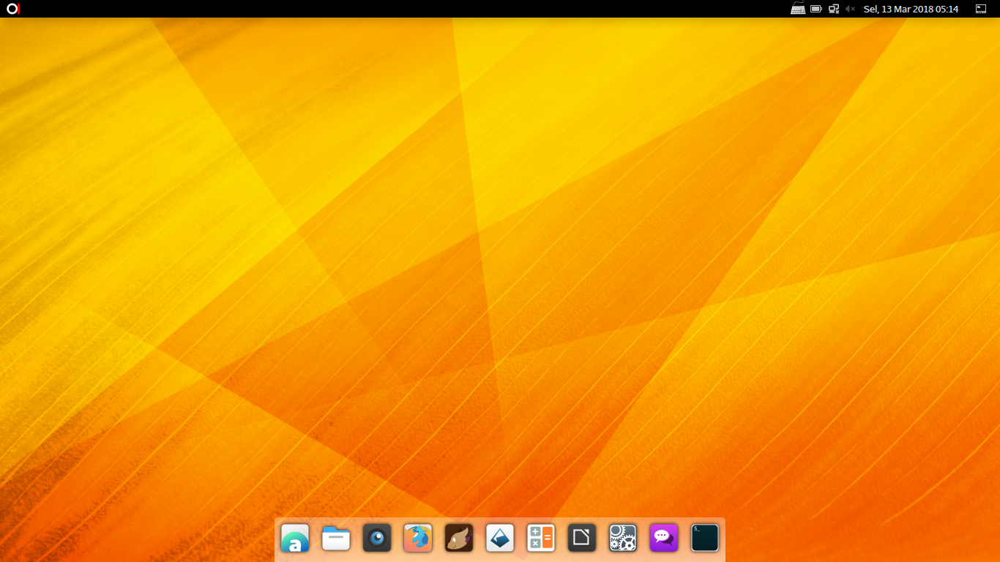

## Mengenal Destop BlankOn
  * Area kerja

    Area kerja merupakan tempat di mana jendela-jendela aplikasi ditempatkan serta ikon-ikon destop ditampilkan. 

  * Panel

    Panel berisi ikon-ikon dan objek yang membantu Anda dalam bekerja. Panel bawaan di BlankOn menggunakan panel yang merupakan pengembangan mandiri dari pengembang BlankOn yang diberi nama Manokwari. Berikut adalah bagian-bagian dari Manokwari:

### Menu Utama

Menu Utama berbentuk logo BlankOn dan berada di pojok kiri atas. Menu Utama digunakan untuk membuka suatu aplikasi atau perintah tertentu. Ketika menu utama diklik maka secara otomatis muncul beberapa menu berdasarkan kelompok aplikasi dan perintah penting tertentu.

### Bilah Aplikasi
Aplikasi berada di sebelah kanan Menu Utama. Bilah Aplikasi berisi daftar aplikasi atau perintah tertentu yang sedang dibuka. Bilah 

### Notifikasi
Notifikasi menampilkan informasi dari **sistem** dan **aplikasi** tertentu yang sedang aktif. Ketika aplikasi atau sistem ingin memberikan suatu informasi, maka akan muncul notifikasi di bagian atas layar. Contoh, jika Anda mendapatkan pesan obrolan atau surel baru maka akan ada notifikasi di bagian atas layar yang menginformasikan hal tersebut.

#### Menyembunyikan Notifikasi
Jika Anda sedang bekerja dan tidak ingin diganggu oleh notifikasi, Anda dapat menyembunyikan atau mematikan notifikasi, berikut caranya:

Klik menu utama  **BlankOn** => **Pengaturan**  => **Notifikasi**, kemudian matikan notifikasi dengan mengklik tombol di samping **Popup Notification** sehingga tulisan **Nyala** berubah menjadi **Mati**.

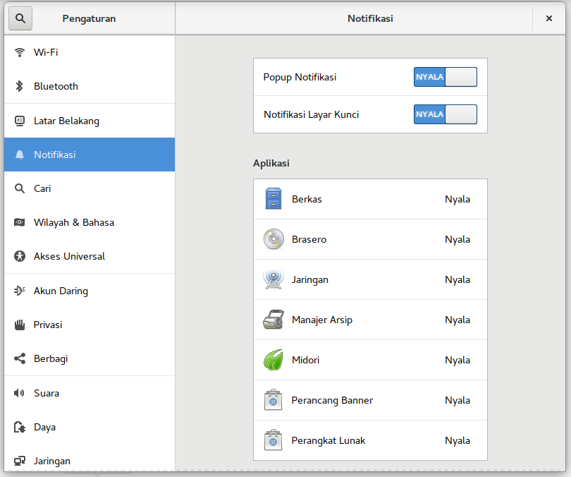

Jika notifikasi dimatikan, maka notifikasi tidak muncul pada bagian atas layar, akan tetapi tetap terbuka jika Anda mengeklik bagian jam.

##### Mengatur Notifikasi Aplikasi
Anda juga dapat mengatur notifikasi aplikasi satu persatu dengan memilih aplikasi pada panel notifikasi. Status notifikasi ditunjukkan disebelah kanan dengan tulisan **Mati** atau **Nyala**. 

### Tanggal dan Waktu
Berisi keterangan tentang hari, jam, tanggal, bulan, tahun.

#### Mengatur Tanggal dan Waktu Secara Manual
Anda dapat mengatur Tanggal dan Waktu secara manual dengan menge-klik **Menu utama BlankOn** => **Pengaturan** => **Rincian** => **Tanggal & Waktu**. Matikan pengaturan **Tanggal & Waktu Otomatis** dengan melakukan klik pada tombol yang tersedia sehingga tulisan **Nyala** berubah menjadi **Mati**. Klik **Tanggal & Waktu**, maka secara otomatis muncul subjendela pengatur **Tanggal dan Waktu** secara manual, klik tanda **tambah (+)** untuk menambah (memajukan) **Jam**, **Menit**, **Hari**, **Bulan**, dan **Tahun** sedangkan untuk **mengurangi** (memundurkan) dapat dilakukan dengan klik  tanda **minus (-)**.

### Penukar Area Kerja
BlankOn menyediakan empat buah area kerja yang bisa Anda gunakan. Jika sebuah area kerja penuh, Anda bisa berpindah ke area kerja lain dengan memanfaatkan penukar area kerja.  Anda dapat memindahkan suatu jendela dari suatu area kerja ke area kerja lainnya dengan cara **klik kanan Aplikasi yang akan dipindah** => **Pindah Ke Area Kerja Lain**. Untuk melihat aplikasi yang sedang aktif pada Area Kerja tertentu klik ikon **Penukar Area Kerja** di pojok kanan atas Destop, kemudian pilih salah satu area kerja dimana aplikasi tersebut berada. 

### Panel Menu Utama
Panel Menu Utama berisi bilah **pencarian**, beberapa kelompok **aplikasi**, **Place and setting dan sessions**.

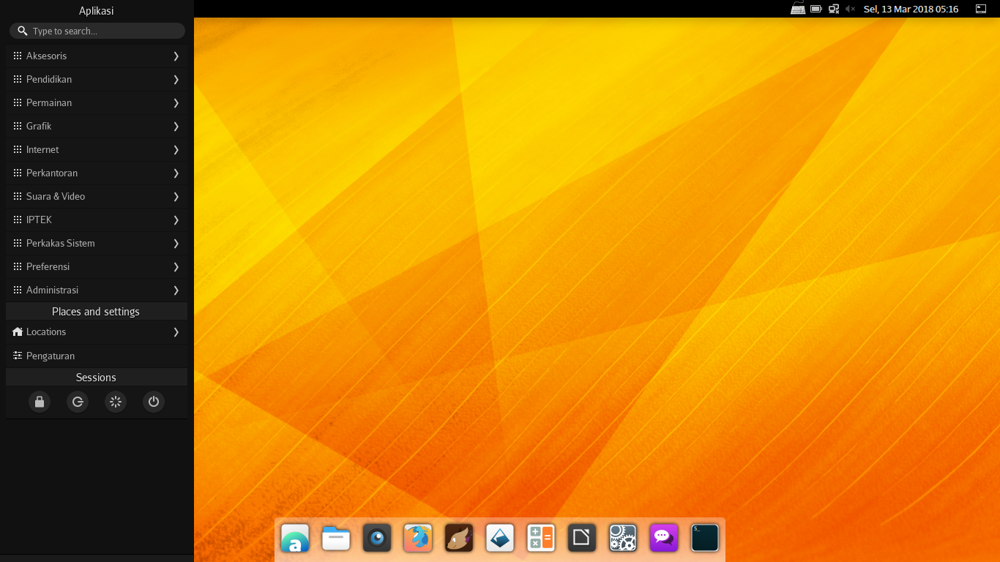

Ketika kita memasukkan kata kunci pada bilah pencarian maka akan ditampilkan aplikasi terpasang sesuai kata kunci (bila ada), Run 'kata kunci' pada Terminal, search 'kata kunci' pada Google dan Wikipedia.

Di bawah bilah pencarian ada beberapa kelompok aplikasi; **Aksesoris, Pendidikan, Permainan, Grafik, Internet, perkantoran, Suara & Video, IPTEK, Perkakas Sistem, Preferensi dan Adminitrasi**. Kelompok-kelompok aplikasi ini berisi daftar aplikasi yang sudah terpasang pada BlankOn.

Menu **Place and settings** berisi **Locations** dan **Pengaturan**. **Locations ** untuk membuka folder Beranda/Rumah, Desktop, Dokumen, Unduhan, Musik, Gambar, Publik, Templates atau Video. Adapun **Pengaturan** digunakan untuk melakukan pengaturan destop sistem. 

Di bagian paling bawah Panel Menu Utama terdapat satu buah menu yaitu **Sessions**. Menu Sessions berisi beberapa tombol dalam bentuk ikon yang fungsinya untuk **Mengunci layar (lock screen)**, **keluar (logout)**, **Nyalakan ulang (restart)** dan **Matikan (shutdown)**.

### Panel Kanan

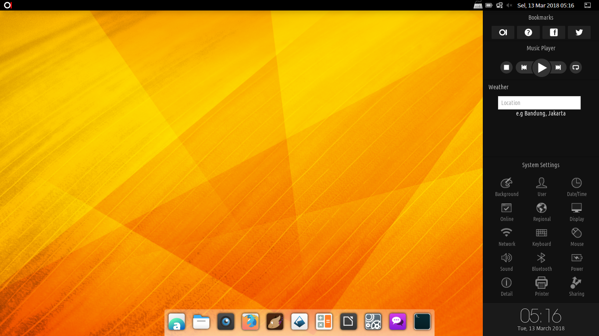

Panel Kanan muncul bila kita mengarahkan kursor tetikus / *mouse* ke tepi kanan-atas destop beberapa saat. Panel Kanan terdriri dari 4 bagian;

#### Bookmarks
Bookmarks berisi ikon-ikon untuk membuka laman;

  - Laman BlankOn: blankonlinux.or.id
  - Laman Panduan BlankOn: panduan.blankonlinux.or.id
  - Grup BlankOn di Facebook: facebook.com/groups/blankonlinux
  - Twitter BlankOn: twitter.com/BlankOnLinux/

#### Music Player
Music Player berisi tombol-tombol pemutar musik (Audacious). Ada 5 tombol;

- Stop/Quit : Mematikan aplikasi
- Previous : Memutar kembali musik sebelumnya (dalam daftar musik yang sedang diputar)
- Play/Pause : Memutar atau menjeda 
- Next : Memutar musik selanjutnya (dalam daftar musik yang sedang diputar).
- Repeat : mengulang pemutaran musik.
  
#### Weather
Weather menyajikan prakiraan cuaca setempat yang meliputi suhu dan kecerahan dalam sepekan. Pada weather terdapat dua tombol;

- Ikon roda gerigi untuk membuka panel opsi sehingga kita dapat menentukan lokasi, satuan suhu, mph atau kph atau m/s, dan memilih warna latar.
- Ikon lingkaran berpanah untuk memuat ulang data cuaca yang ditampilkan

#### System Settings
System Settings menampilkan tautan-tautan untuk membuka panel pengaturan;

- Latar Belakang
- Pengguna
- Tanggal & Waktu
- Akun Daring
- Wilayah & Bahasa
- Tampilan
- Jaringan
- Papan Ketik
- Mouse dan Touchpad
- Sound
- Bluetooth
- Daya
- Rincian
- Pencetak
- Berbagi Pakai

#### Jam dan tanggal
- Jam ditampilkan dengan format **HH:MM**, sedangkan tanggal ditampilkan dengan format **DDD**, **DD MMMM YYYY** misalnya; **05:16 Tue**, **13 March 2018**. 

  ​
## Bekerja dengan Aplikasi 
Untuk membuka suatu aplikasi pada BlankOn, Anda bisa memanfaatkan menu utama. Aplikasi yang berada di dalam menu tersebut dikelompokkan berdasarkan jenisnya, yaitu **Aksesoris, Pendidikan, Permainan, Grafik, Internet, perkantoran, Suara & Video, IPTEK, Perkakas Sistem, Preferensi dan Adminitrasi**. Jadi, Anda bisa lebih mudah mencari aplikasi yang akan Anda buka. 

### Tombol Pintas 
Untuk mempermudah Anda bekerja menggunakan destop BlankOn dan memanipulasi jendela aplikasi, Anda bisa menggunakan tombol pintas atau keyboard *shortcut* tertentu yang setiap perpaduannya memiliki fungsi khusus. Berikut adalah penjelasan masing-masing tombol pintas: 

##### Tombol Pintas Fungsi 

| Tombol Pintas  	| 				Keterangan			  	|
| ---------------------- |-----------------------------------------------------------------|
| PrtSc / SysRq           | Mengambil tangkapan layar pada destop.                            |
| Alt + Tab               | Berpindah antar jendela yang sedang aktif.                        |
| Ctrl + Alt + Left/Right | Cursor Berpindah antara area kerja.                               |
| Alt+F4                  | Menutup jendela yang sedang aktif.                                |
| Alt+F5                  | Mengembalikan ukuran jendela yang sedang aktif ke ukuran normal.  |
| Alt+Space               | Menampilkan menu untuk memanipulasi jendela yang aktif            |
| Alt+F10                 | Memperbesar jendela yang sedang aktif.                            |
| Alt+F8                  | Mengubah ukuran jendela yang sedang aktif                         |
| Alt+F7                  | Memindahkan jendela yang sedang aktif                             |
| Ctrl+Alt+L              | Mengunci layar                                                    |

#### Tambahkan Aplikasi ke Menu Favorit
Anda dapat menambah aplikasi yang sering digunakan pada **Menu Favorit** di destop sesuai dengan keinginan dengan cara klik kanan pada nama aplikasi pada panel kiri. Misalnya kita ingin menambakan aplikasi Vim pada Menu Favorit, klik menu utama **BlakOn** => **Aksesoris** , kemudian klik kanan pada label **Vim**, kemudian klik **Add to Desktop**.

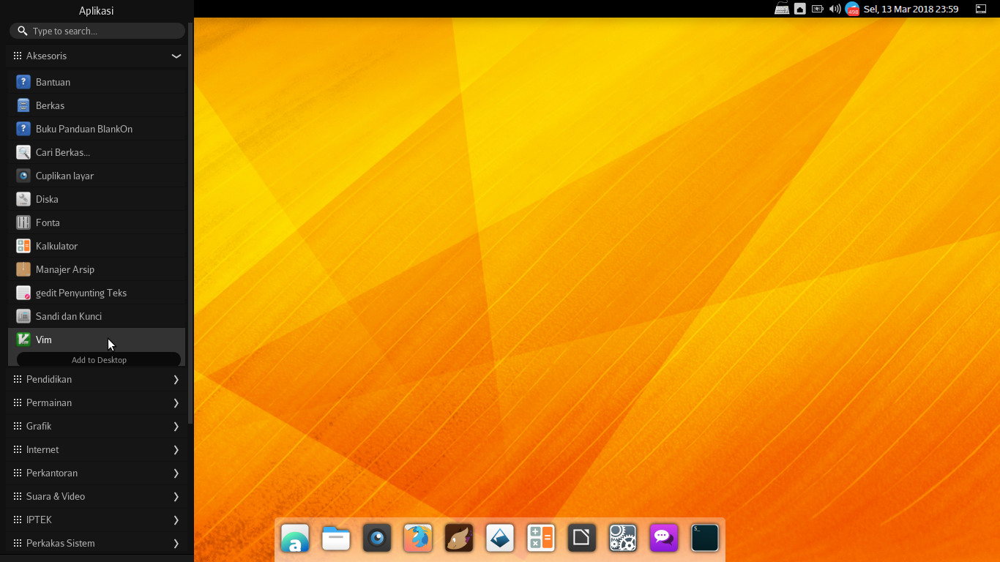

#### Hapus Aplikasi dari Menu Favorit
Untuk menghapus aplikasi dari Menu Favorit lakukan langkah berikut; klik tombol kiri tetikus, tahan aplikasi tersebut, kemudian seret ke tempat sampah yang secara otomatis muncul  di atas panel tersebut.

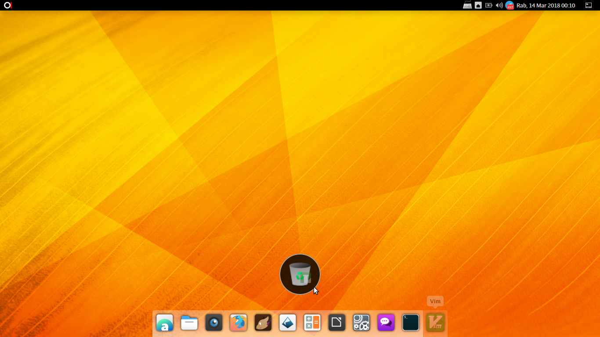

 Adapun untuk mengubah nama aplikasi, klik menu utama **BlankOn** => **Locations** => **Desktop**, kemudian klik kanan nama aplikasi, pilih ubah nama, tulis nama sesuai yang dikehendaki. 

### Mengganti Latar Belakang
Anda bisa mengatur tampilan latar belakang destop sesuai selera. Latar Belakang dapat Anda ganti dengan gambar yang sudah disediakan secara baku oleh BlankOn atau dengan gambar koleksi Pribadi.

#### Mengganti Latar Belakang dengan Gambar Baku
Untuk mengganti gambar Latar belakang dengan gambar tertentu yang sudah disediakan secara baku oleh BlankOn, klik **Pengaturan** => **Latar Belakang**,  maka otomatis tampil jendela untuk mengatur Latar Belakang.  Ada 2 (dua) menu, yaitu; **Latar Belakang (*background*)** dan **Kunci Layar (*lockscreen*)**. Latar Belakang digunakan untuk mengatur gambar latar belakang pada destop, sedangkan Kunci Layar digunakan untuk mengatur gambar latar belakang ketika Anda mengunci komputer.

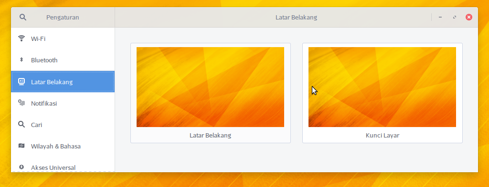

Sesaat setelah menu latar belakang diklik maka secara otomatis tampil subjendela pengatur latar belakang yang terdiri dari 3 (tiga) tab, yaitu **Gambar latar**, **Gambar**, dan **Warna**. 

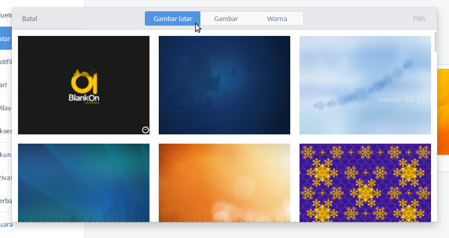

Pilih salah satu tab (misal tab  Gambar latar), klik salah satu gambar yang akan dijadikan latar belakang untuk destop, klik tombol **Pilih** di pojok kanan atas jendela., maka secara otomatis gambar latar belakang pada destop berubah sesuai gambar yang tadi dipilih.

#### Mengganti Latar Belakang dengan Gambar Koleksi Pribadi
Anda dapat mengganti gambar latar belakang pada destop dengan gambar koleksi milik pribadi, berikut caranya: cari gambar yang akan dijadikan latar belakang di direktori komputer Anda, kemudian **klik kanan gambar** tersebut, pilih **Jadikan gambar Latar**.

## Pengaturan Pengguna
Sistem operasi BlankOn merupakan sistem operasi *multiuser* atau banyak pengguna. Linux bisa digunakan oleh banyak pengguna yang memiliki ruang dan lingkungan masing-masing. Setiap pengguna juga memiliki nama akun pengguna (*user id*) dan kata sandi. Nama pengguna dan sandi ini akan diminta pada saat pertama kali menjalankan BlankOn. Oleh karena itu, pengetahuan tentang manajemen pengguna sangat dibutuhkan dalam mempelajari BlankOn. Baik bagi mereka yang sekadar pengguna rumahan yang hanya memilik satu jenis pengguna di sistem mereka, ataupun mereka yang bertindak sebagai sistem administrator. 

Untuk melakukan pengaturan informasi pribadi seperti nama, foto, kata sandi dan sebagainya untuk disimpan oleh sistem, Anda bisa membuka pengaturannya dengan klik **Pengaturan => rincian => Pengguna**. Sebelum melakukan pengaturan Anda harus **Membuka Kunci** dengan cara klik tombol **Buka Kunci**. Masukkan **sandi Administrator** untuk pembukaan kunci tersebut. 

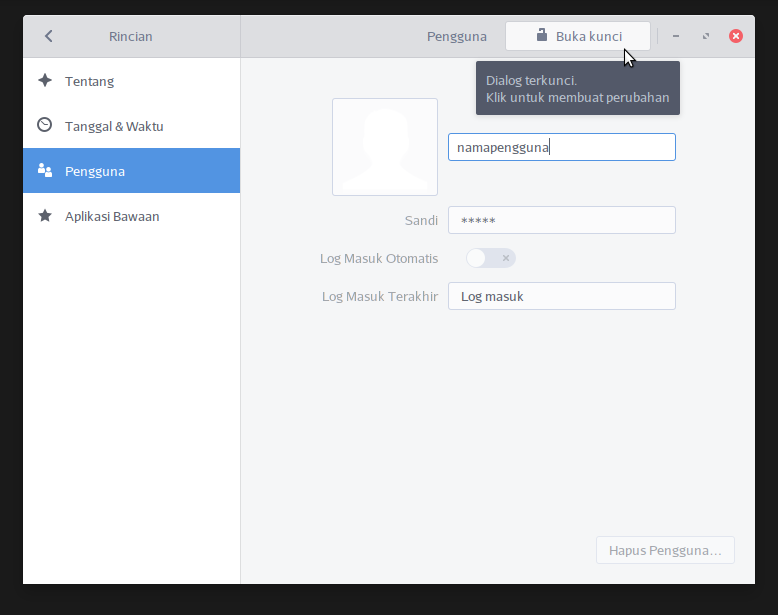

### Tambah Pengguna
Untuk menambahkan akun, klik tombol  **Tambah Pengguna ...** dipojok kanan atas. Pilih tipe akun (satndar atau administrator), nama lengkap dan nama pengguna dan atur sandi, kemudian klik tombol **Tambah**.

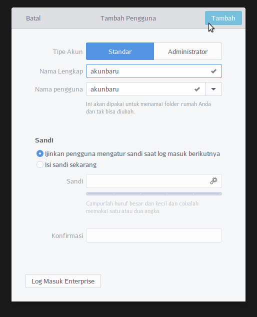

Untuk menggunakan sistem dengan pengguna yang baru ditambahkan tadi, silakan keluar dari destop BlankOn melalui **menu utama BlankOn => Sessions => Keluar (logout)**, kemudian masuk menggunakan akun yang sudah ditambahkan.

### Mengganti Gambar Pengguna
Untuk mengganti gambar akun, tombol **Buka kunci**, ketik sandi **Administrator**, kemudian tekan tombol **Authenticate**. Langkah selanjutnya yaitu, klik gambar pengguna, kemudian pilih gambar yang sesuai. 
Jika ingin menggunakan gambar yang tersimpan di komputer, klik **Ramban lebih banyak gambar**..., kemudian lakukan pencarian pada folder dimana Anda meletakkan gambar yang ingin digunakan, klik gambar tersebut kemudian klik tombol **buka** di pojok kanan atas jendela, atur besarnya tampilan gambar, kemudian klik **Pilih**.

### Hapus Pengguna 
Untuk menghapus pengguna yang sudah ada, klik ikon **gembok** atau tulisan **Buka kunci** di sebelah kanan atas. Anda akan ditanyakan kata sandi, ketikkan kata sandi **Administrator** Anda, klik tombol **Authenticate**, kemudian klik pengguna yang akan dihapus, setelah itu klik tombol **Hapus Akun** yang terletak di sebelah kanan bagian bawah.

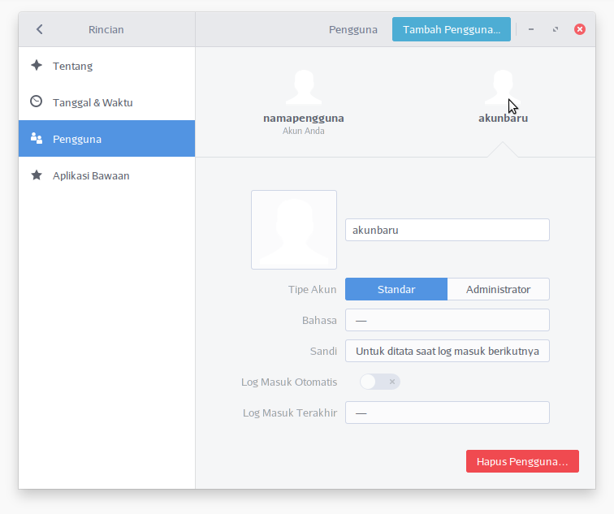

### Privasi
Privasi digunakan untuk mematikan atau menyalakan beberapa fitur; Kunci Layar, Layanan Lokasi, Pemakaian & Riwayat dan Kosongkan Tong Sampah & Berkas Temporer. Untuk mengatur fitur privasi klik **Menu Utama BlankOn**  => **Pengaturan** => **Privasi**.

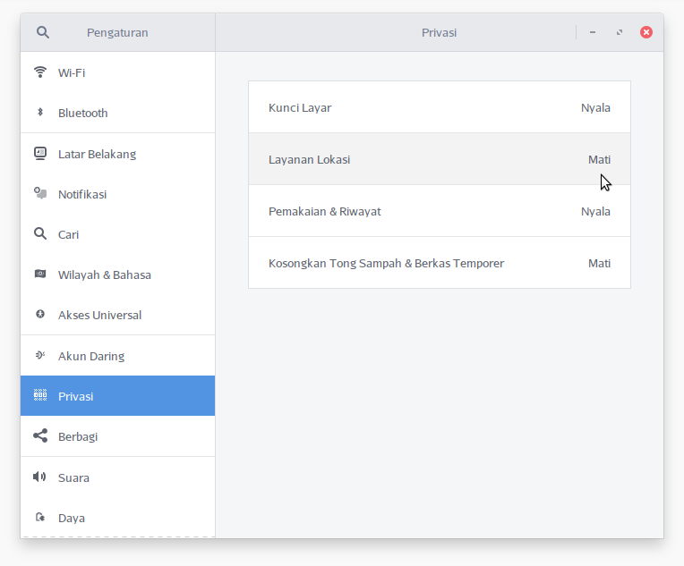

#### Kunci Layar (Mati atau Nyala)
Bila Kunci Layar nyala, maka layar akan dikunci ketika komputer nganggur dalam waktu tertentu sehingga privasi Anda akan tetap terlindung saat Anda meninggalkan komputer dalam keadaan nyala.
Terdapat **3 (tiga)** komponen dalam jendela pengaturan **Kunci Layar** yaitu;

##### Kunci Layar Otomatis
Anda dapat mengatur agar layar terkunci secara otomatis dengan melakukan klik pada **tombol** yang tersedia sehingga berubah menjadi **tanda centang**, jika ingin mematikannya klik lagi tombol tersebut sehingga berubah menjadi **tanda silang**.

##### Kunci layar setelah kosong selama
Komponen ini digunakan untuk mengunci layar secara otomatis ketika komputer sedang tidak digunakan berdasarkan jeda waktu tertentu, Anda dapat mengatur jeda waktu pada menu yang tersedia (setiap 30 detik, 1, 2, 3, 4, 5, 30 menit atau 1 jam)

##### Tampilkan Pemberitahuan
Anda dapat mengatur pemberitahuan agar tampil secara otomatis dengan melakukan klik pada tombol yang tersedia sehingga berubah menjadi tanda centang, jika ingin mematikannya klik lagi tombol tersebut sehingga berubah menjadi tanda silang.

#### Layanan Lokas (Mati atau Nyala)
Layanan lokasi ini dapat aktif bila komputer terhubung dengan internet
​       
#### Pemakaian & Riwayat 
Dengan menyalakan Pemakaian & Riwayat, komputer akan mencatat riwayat penggunaan komputer seperti berkas apa saja yang telah dibuka. Pencatatan riwayat ini dapat mempermudah Anda bila hendak membuka atau menggunakan kembali berkas-berkas tersebut. 

Anda juga dapat mengatur jangka waktu penyimpanan riwayat (selama 1, 7, atau 30 hari atau bahkan selamanya/tanpa batasan). Pada bagian bawah kotak dialog Pemakaian & Riwayat, ada tombol **Bersihkan Riwayat Baru-baru Ini**.

#### Kosongkan Tong Sampah & Berkas Temporer
Berkas-berkas pada Tong Sampah dan Berkas-berkas Temporer dapat dihapus baik secara manual maupun secara otomatis. Pada tatanan Privasi, Anda dapat menyalakan dan mengatur pembersihan berkas-berkas pada tong sampah dan atau berkas-berkas temporer.

Anda juga dapat mengatur jangka waktu pembersihan berkas pada tong sampah dan atau berkas temporer secara otomatis (setiap 1 jam, 1 hari, 7 hari, 14 hari, atau 30 hari).
Pada bagian bawah kotak dialog Kosongkan Tong Sampah & Berkas Temporer terdapat dua tombol pembersihan secara langsung;

- Kosongkan Tong Sampah

- Bersihkan Berkas Temporer

  ​

### Mengunci Layar 
Jika Anda akan meninggalkan komputer dalam keadaan hidup dan Anda tidak ingin komputer diutak-atik oleh orang lain, Anda bisa mengunci layar komputer tersebut. Sehingga, jika ingin kembali bekerja dengan destop, Anda harus kembali memasukkan sandi terlebih dahulu. Untuk mengunci layar klik **menu utama BlankOn => Session => Lock Screen**. 

Jika ingin mengaktifkan kembali destop, geser *mouse* atau tekan sembarang tombol di *keyboard*, masukkan sandi Anda, kemudian klik tombol **Buka Kunci**. 

### Mengakhiri Sesi 
Untuk mengakhiri sesi bekerja Anda di BlankOn tanpa mematikan komputer, caranya adalah klik **menu utama BlankOn => Session => Logout => Logout Now**.

### Menghidupkan Ulang Komputer
Untuk menghidupkan ulang komputer saat sedang digunakan, **menu utama BlankOn => Session => Restart => Restart Now**.

### Mematikan Komputer 
Untuk mematikan komputer, caranya adalah klik **menu utama BlankOn => Session => Shutdown** lalu klik tombol **Shutdown Now** maka komputer secara otomatis akan mati sendiri.

